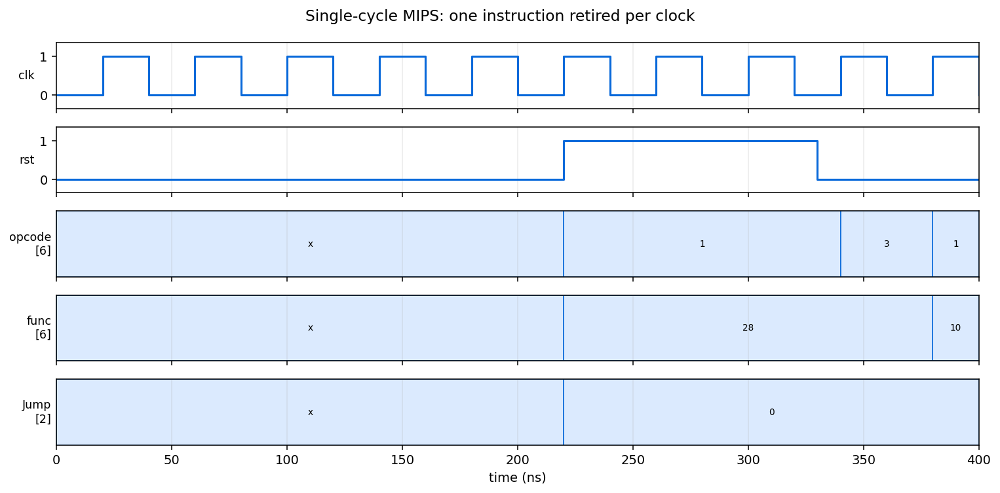

# Single-Cycle MIPS

A MIPS processor in SystemVerilog that completes one instruction per clock
cycle. Every stage of the datapath is combinational between two clock edges, so
the cycle has to be long enough for the slowest instruction to finish.



## Requirements

[Icarus Verilog](https://steveicarus.github.io/iverilog/) and `make`.

## Simulating

```bash
make sim
```

Loads `Code/instruction_memory.mem` and `Code/data_memory.mem`, runs the
program, and writes `Code/sim.vcd`.

## The single-cycle tradeoff

Everything happens in one cycle: fetch, decode, register read, ALU, memory
access, write back. The control unit is purely combinational, decoding the
opcode into the mux selects and enables the datapath needs, with no state at all.

That simplicity costs clock speed. The cycle must accommodate the longest path,
which is a load: instruction memory, register file, ALU for the address, data
memory, then the write-back mux. An add instruction touches none of the memory
stages and still waits the same amount of time. The multi-cycle and pipelined
designs both exist to reclaim that.

## Datapath

| unit | role |
| --- | --- |
| `PC` | Program counter, incremented by four or loaded from a branch or jump target |
| `InstructionMemory` | Word-addressed, read only |
| `RegisterFile` | Two read ports, one write port |
| `SignExtend` | Widens the 16-bit immediate to 32 bits |
| `Shift_Left2` | Scales branch offsets and jump targets to word addresses |
| `ALU` | Arithmetic, logic, and the zero flag branches test |
| `DataMemory` | Load and store |
| `MUX` | Selects between register and immediate, ALU result and memory, and the next PC |

`Controller` decodes the opcode and function field into every select and enable
above.

## Project structure

```
Code/
    MIPS.sv                  the top level
    Controller.sv            opcode and function decode
    Datapath.sv              wires the units together
    PC.sv, ALU.sv, RegisterFile.sv, InstructionMemory.sv, DataMemory.sv
    SignExtend.sv, Shift_Left2.sv, MUX.sv
    instruction_memory.mem   the program
    data_memory.mem          initial data
    Testbench.sv             clock, reset, and run
docs/waveform.png            the figure above
Makefile                     sim and clean
```
